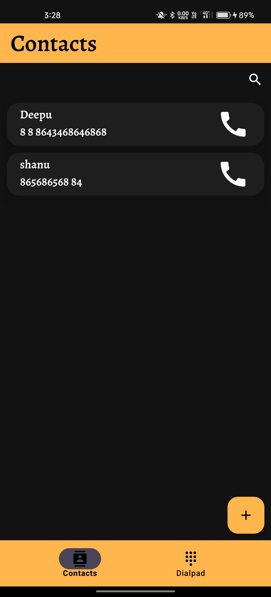
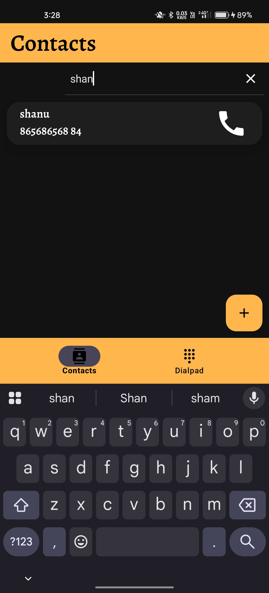
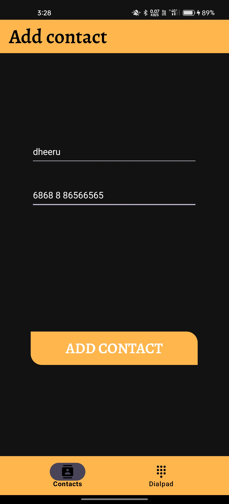
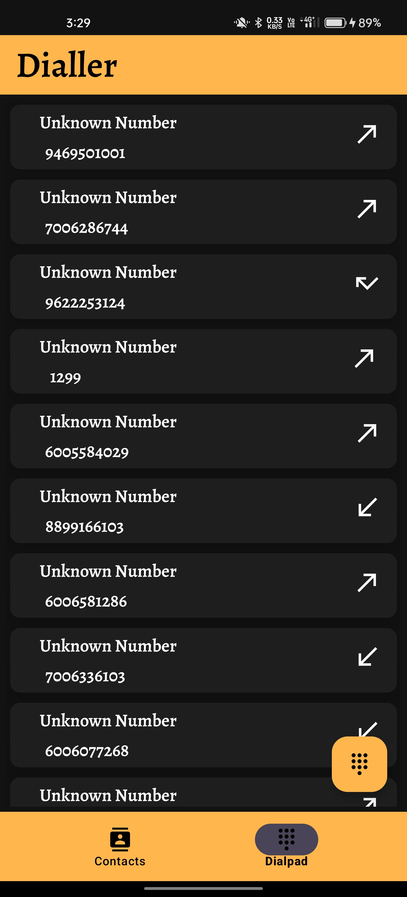
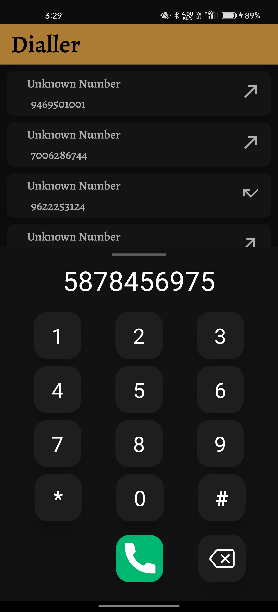

# 📞 Custom Dialer App

> A modern custom dialer app with contact integration, call logs, offline data support, and a fully functional dialpad.

<br>

## 🖼️ Screenshots

<!-- Replace the underscores with actual image filenames like dialpad.jpg, logs.jpg etc -->
### 🔸 Home Screen


### 🔸 Search View


### 🔸 Add Contact Fragment


### 🔸 Dialer Fragment (with Logs)


### 🔸 DialPad to Call


<br>

## 🚀 Features

- 🔢 Custom dial pad UI
- 📞 Make direct phone calls
- 📋 View call history
- 👥 Access and use device contacts
- 💾 Offline data persistence using Room
- ⚙️ Smooth performance with MVVM architecture

<br>

## 🔧 Tech Stack

- **Language:** Kotlin
- **Architecture:** MVVM
- **Backend:** Room Database
- **Libraries:**
    - ViewModel & LiveData
    - RecyclerView
    - ViewBinding
    - Coroutines
    - ContentResolver API

<br>

## 🛠️ Installation

1. Clone the repository
   ```bash
   git clone https://github.com/pushphans/CustomDialer.git
   
2. Open the project in Android Studio

3. Run on a real device (calling functionality may not work on emulator)

<br>

##⚙️ Required Permissions
- CALL_PHONE

- READ_CONTACTS

- READ_CALL_LOG

- WRITE_CALL_LOG
> Make sure to grant all runtime permissions for full access.

<br>

## 📬 Contact
> For any suggestions or feedback, feel free to reach out at: pushp.hans1502@gmail.com